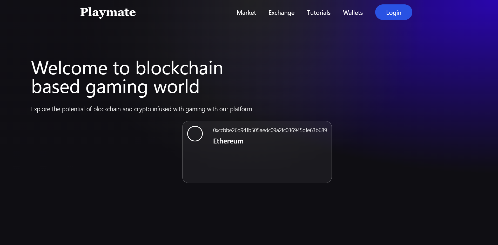
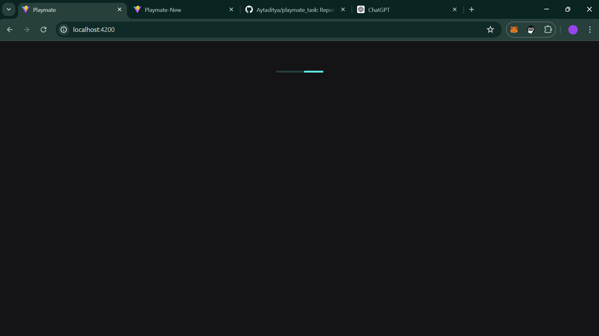

# Blockchain Wallet Connection Demonstration

## Overview

Due to several issues encountered with the initial codebase provided for this task, I created a new GitHub repository to demonstrate a simple wallet connection in blockchain technology. This repository showcases a functional implementation of wallet integration and is intended to address the recruitment task given by Playmate.




## NOTE

All the styling and programming of this file is done by me and is not similar to initially provided codebase.

## Error in initial codebase
The initial codebase appearance


## Purpose

This repository serves as a solution to the recruitment task assigned by Playmate. It provides a streamlined example of how to connect a blockchain wallet, addressing the errors found in the original codebase.

## Demo

A demo video of the initial GitHub repository and what it looked like when run is included at the beginning of the demo video linked below:


## Repository Contents

- **`src/`**: Contains the source code for wallet connection functionality.
- **`public/`**: Static files, including HTML and CSS.
- **`README.md`**: This file.
- **`package.json`**: Project dependencies and scripts.

## Setup

To run this project locally:

1. Clone this repository:
   ```bash
   git clone https://github.com/Aytaditya/playmate_task.git
   ```
